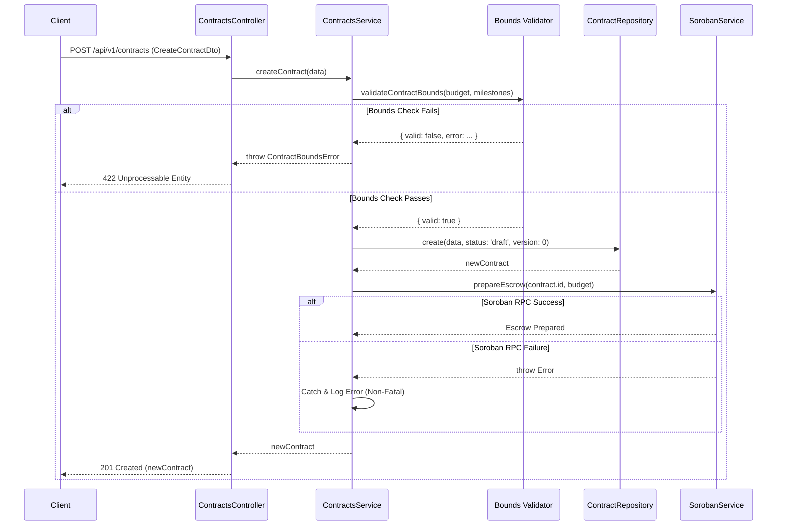

# Escrow Contract Lifecycle and Bounds Enforcement

This document outlines the architecture, state transitions, security bounds, and blockchain orchestration involved in the TalentTrust decentralized freelancer escrow protocol. Contracts flow through the Controller (`src/controllers/contracts.controller.ts`), Service (`src/services/contracts.service.ts`), and Repository (`src/repositories/contractRepository.ts`) layers.

## 1. Policy Bounds

To prevent griefing and cap worst-case resource usage, strict limits are enforced at the API layer. The Soroban escrow contract stores milestones in a bounded vector; keeping limits strictly enforced off-chain prevents overflow and high gas utilization during downstream contract calls.

**Current Limits:**
* **Maximum Milestones:** `20` per contract
* **Maximum Budget:** `100,000,000,000,000` stroops (10,000,000 XLM)

**Discovery:**
Clients can dynamically discover these limits without hardcoding them by calling the discovery endpoint:
```http
GET /api/v1/contracts/bounds
```
*Note: These limits are hard-coded policy decisions within `src/contracts/bounds.ts` and require a code review to change. There is no runtime toggle to avoid misconfiguration risks.*

## 2. Contract Lifecycle & States
Contracts in TalentTrust act as the off-chain representation of an upcoming or active on-chain escrow.

### Status Flow
1. **Draft (`draft`)**: The default state when a contract is created. At this stage, boundaries and schema validation have passed, and the record exists in the database.
2. **Funded (`funded`)**: (Typical next state) The client deposits XLM matching the contract amount into the Soroban smart contract.
3. **Active/In Progress (`active`)**: Work has commenced.
4. **Completed / Disputed**: End-of-lifecycle states depending on mutual agreement or arbitration.

## 3. Optimistic Concurrency Control (OCC)
To prevent race conditions during updates (e.g., simultaneous status changes or edits), the repository implements Optimistic Concurrency Control using a `version` integer.

### How it Works:
- Every contract row tracks its current `version` (starting at `0`).
- When updating a contract, the client or service must provide the `expectedVersion` it last read.
- The `updateWithVersion` method in `ContractRepository` atomically checks the version during the `UPDATE` query:
```SQL
UPDATE contracts SET ..., version = version + 1 WHERE id = ? AND version = ?
```
- If `result.changes === 0`, it means either the contract was deleted or the version has drifted. The API throws a `VersionConflictError`, forcing the client to fetch the latest state and retry.

## 4. Escrow Hand-off (Soroban Integration)
When a contract is successfully validated and stored, the backend orchestrates a hand-off to the blockchain via `SorobanService.prepareEscrow`.

**Fault Tolerance:**

To maximize availability, `prepareEscrow` failures are tolerated and non-fatal. If the Soroban RPC is down or the network times out, the `ContractsService` catches the error, logs a warning (`[ContractsService] Soroban prepareEscrow failed...`), and successfully returns the created contract to the user. This ensures the off-chain system stays highly available even during degraded on-chain network conditions.

### Sequence Diagram: Creation & Hand-off
